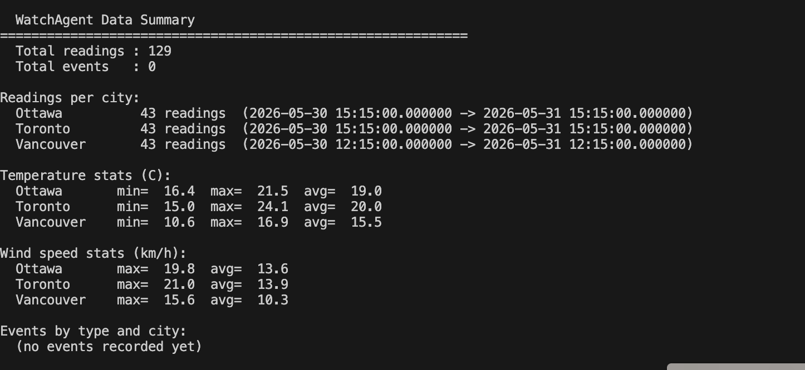

# WatchAgent Weather Monitor

This is my submission for the WatchAgent take-home challenge. The task was to build a service that monitors live weather across three Canadian cities, decides when something notable happens, and exposes that through an API.

The interesting part of the problem is not fetching data (that's a few lines of code). The interesting part is deciding what counts as worth surfacing and what is just noise. That's what most of my design time went into.

---

## How it works

The poller runs every 15 minutes and fetches current conditions from Open-Meteo for Ottawa, Toronto, and Vancouver. Open-Meteo updates hourly, so most polls return data that's already been stored. The system checks for duplicates before inserting —if the same combination `(city, observed_at)` already exists, it skips the insert entirely and does not run event detection.

Event detection only runs when a genuinely new reading comes in. That was an intentional design decision. Running detectors on duplicate data would either fire duplicate events or require extra logic to suppress them. Deduplicating first keeps the event detection layer clean.

```
Open-Meteo API  (free, no key, updates hourly)
        │
        ▼
  weather_client.py
  fetches conditions for one city at a time
        │
        ▼
    poller.py
  runs every 15 min for all three cities
  checks (city, observed_at) before inserting
        │
        ├── duplicate → skip, no event detection
        │
        └── new reading → insert → commit
                │
                ▼
        event_detection/
          detectors.py   pure functions, no DB access
          cooldown.py    suppresses repeat events
          engine.py      runs detectors, checks cooldown, saves WeatherEvent
                │
                ▼
        SQLite  (weather_readings + weather_events)
        persisted in ./data/weather.db
                │
                ▼
        FastAPI
        /health   /readings   /events
```

Two Docker containers share a `./data` volume so they both read and write the same SQLite file. The poller waits for the API healthcheck to pass before its first poll, which avoids a race condition on cold start where the poller tries to write before the database is initialized.

There is also a safeguard to avoid running two pollers at once: `POLLER_ENABLED` is set to `false` in the API container and `true` in the dedicated poller container.

---

## Polling Interval

The poller runs every `15 minutes`. Open-Meteo updates hourly, so this is frequent enough to pick up new hourly data quickly while staying lightweight.

Why `15 minutes`:

1. Detects new hourly data soon after it appears.
2. Avoids unnecessary API load.
3. Shows visible runtime activity during short reviewer sessions.
4. Four requests per city per hour (12 in total) is negligible load on a free API with no rate limits.

Duplicate control via `(city, observed_at)` means frequent polling does not create duplicate readings or duplicate detector runs.

Flow:

```text
Poll Open-Meteo every 15 minutes
        ↓
Fetch latest reading for each city
        ↓
Check if (city, observed_at) already exists
        ↓
If duplicate: skip insert and skip event detection
        ↓
If new: insert reading, commit, then run event detection
```

---

## Getting started

You need Docker and Git. Nothing else.

```bash
git clone https://github.com/niamatolla/watchagent-weather-monitor
cd watchagent-weather-monitor
cp .env.example .env
docker compose up --build
```

After about 30 seconds the API is up at `http://localhost:8000`. The poller starts its first cycle automatically.

To stop and restart without losing data:

```bash
docker compose down
docker compose up
```

The database lives in `./data/weather.db` which is mounted into both containers, so it survives restarts.

---

## Environment variables

No credentials needed. Open-Meteo is completely free and unauthenticated.

| Variable | Default | What it does |
|---|---|---|
| `DATABASE_URL` | `sqlite:///data/weather.db` | path to the SQLite file |
| `POLL_INTERVAL_SECONDS` | `900` | seconds between poll cycles |
| `POLLER_ENABLED` | `true` | enables/disables embedded poller loop |
| `APP_NAME` | `WatchAgent Weather Monitor` | cosmetic |
| `APP_VERSION` | `1.0.0` | cosmetic |

---

## API

### GET /health

```bash
curl http://localhost:8000/health
```

```json
{
  "status": "ok",
  "readings_stored": 162,
  "events_stored": 0
}
```

### GET /readings

```bash
curl http://localhost:8000/readings
curl "http://localhost:8000/readings?city=Ottawa&limit=10"
```

Optional: `city`, `limit` (default 50). Returns most recent first.

### GET /events

```bash
curl http://localhost:8000/events
curl "http://localhost:8000/events?city=Vancouver"
curl "http://localhost:8000/events?city=REGIONAL"
```

Optional: `city`, `limit` (default 50). Use `city=REGIONAL` for cross-city events.

---

## Running tests

```bash
pip install -r requirements.txt
pytest
```

No live API calls — everything is mocked or uses synthetic data.

---

## Why I chose these technologies

**FastAPI** — I wanted async support and automatic request/response validation without the overhead of Django. FastAPI gives you typed endpoints with Pydantic and generates OpenAPI docs automatically. For a project this size it felt like the right balance.

**SQLAlchemy + SQLite** — there's only one writer (the poller), the data volume is small, and I didn't want to run a separate database container. SQLite is the right call here. SQLAlchemy made the deduplication constraint and queries clean without writing raw SQL everywhere.

**Pydantic BaseSettings** — lets me load config from environment variables with type enforcement. This is what makes the `.env.example` → `.env` → Docker `env_file` flow work consistently in both local and containerized environments without any special handling.

**Two Docker services** — I could have run the poller as a background thread inside the FastAPI process, but separating them means a poller crash doesn't take down the API and vice versa. It also makes logs easier to read since each service has its own output.

---

## Event detection

### The core problem

I spent a while thinking about what actually makes a weather reading worth surfacing. My first instinct was simple thresholds : fire an event when temperature exceeds 30°C. But that has two problems: it fires continuously as long as the condition holds, and it ignores context. A 28°C reading in Ottawa in January is much more interesting than the same reading in July.

What I landed on was choosing events from different signal categories, so each detector captures something the others don't.

- **Trend events** — something is changing fast
- **Threshold crossing events** — something has passed an important boundary
- **Absolute threshold events** — something is already severe
- **Regional comparison events** — cities are diverging significantly

I also added cooldowns to every detector. Without cooldowns, a sustained storm would produce the same event every hour for 12 hours straight, which defeats the purpose.

### Why events_stored shows 0 in late May

This is expected. None of the four detectors have thresholds that apply to stable spring conditions in Canada. There are no cold fronts, no freeze-thaw transitions, no severe wind events in late May. The system is supposed to be quiet when nothing notable is happening , that's the whole point. The unit tests verify that detection logic fires correctly when conditions warrant it. They use synthetic readings specifically because I can't rely on live weather to produce test events.

### The four detectors

**RapidTemperatureDrop** — fires when temperature drops at least 6°C within a 3-hour window. City-level. 3-hour cooldown.

I chose a drop detector instead of a cold threshold because the signal that matters is how fast conditions are changing, not whether it's currently cold. A city can sit at -5°C all day and that's not new information. A 6°C drop in 3 hours can mean a cold front is moving through. I set 6°C as the threshold because 1–3°C happens naturally throughout the day and would produce constant noise.

**FreezeThawRisk** — fires when temperature crosses 0°C in either direction within a 6-hour window. Ottawa and Toronto only. 6-hour cooldown.

The useful signal here is the transition, not the absolute temperature. When conditions oscillate around freezing, melt/refreeze cycles create icy surfaces. I scoped this to Ottawa and Toronto because that's where it matters. Vancouver rarely gets hard freezes and including it would dilute the event's signal value.

**WindEscalation** — fires when wind speed jumps at least 20 km/h between consecutive readings, or reaches at least 50 km/h. City-level. 3-hour cooldown.

Two conditions because they cover different situations. The jump catches rapidly worsening conditions. The absolute threshold catches already severe wind even if it built up gradually. A reading of 60 km/h matters regardless of what came before it.

**CrossCityTemperatureSpread** — fires when the gap between the warmest and coldest monitored city hits 14°C. Regional. 6-hour cooldown. Stored as `city = "REGIONAL"`.

This one doesn't look at individual cities — it looks at divergence across all three simultaneously. A 14°C spread means conditions across the country are meaningfully different, which is the kind of thing a national infrastructure monitoring context would care about.

### What I decided not to include

Precipitation and weather_code were on my list but I didn't end up using them. A precipitation threshold without a trend component fires continuously during any sustained rain. Weather_code changes are too coarse to build a reliable cooldown around — a code that jumps from 51 to 61 back to 51 in three readings would behave unpredictably. I'd rather have four detectors that each say something distinct than six detectors where two add noise.

### Cooldown table

| Event | Cooldown | Why |
|---|---|---|
| RapidTemperatureDrop | 3 hours | rapid changes can recur; short repeated alerts would be noisy |
| WindEscalation | 3 hours | wind shifts quickly, shorter suppression fits |
| FreezeThawRisk | 6 hours | freeze/thaw patterns evolve slowly |
| CrossCityTemperatureSpread | 6 hours | regional spread typically persists for hours |

Cooldowns use `observed_at` not `created_at`, so suppression follows weather time rather than ingestion time. A delayed poll doesn't incorrectly reset a cooldown window.

Example: a new event with `observed_at = 2026-05-30 16:00` and a 3-hour cooldown triggers this check:

```sql
SELECT * FROM weather_events
WHERE city = 'Ottawa'
  AND event_type = 'RapidTemperatureDrop'
  AND observed_at >= '2026-05-30 13:00'
```

If a row exists, the event is suppressed.

---

## Tests

### Event detection

Each detector has a positive case and a negative case. The negative cases matter as much as the positives — they're what proves the detectors don't fire on normal variation.

| Detector | Fires | Does not fire |
|---|---|---|
| RapidTemperatureDrop | 12.0°C → 5.0°C in 3h | 12.0°C → 8.5°C |
| FreezeThawRisk | Ottawa 1.5°C → -0.5°C | Ottawa 3.0°C → 2.0°C |
| FreezeThawRisk scope | — | Vancouver 1.5°C → -0.5°C |
| WindEscalation | 18.0 → 40.0 km/h | 20.0 → 32.0 km/h |
| CrossCityTemperatureSpread | Ottawa 2°C, Toronto 5°C, Vancouver 16°C | Ottawa 9°C, Toronto 11°C, Vancouver 14°C |

### Deduplication

`fetch_current_weather("Ottawa")` is mocked to return the same payload twice. `poll_all_cities()` runs twice. The test asserts the final row count for `(city="Ottawa", observed_at=<same timestamp>)` is exactly 1 and that event detection did not run on the second call.

### API shape

All three endpoints tested against a seeded in-memory SQLite database. Covers status codes, response structure, required fields, ordering, and city filtering. No file I/O, no real database needed.

---

## Cursor setup

I tried to make the Cursor setup actually reflect this codebase rather than copy generic rules from a tutorial. The rules encode decisions I already made. The agent has context specific to this project. The skill queries real data.

### Rules

**`poller_conventions.md`**

This rule covers the two most likely failure modes in a long-running poller.

Fetch failures: log the city name, HTTP status or error reason, and retry count at WARNING level. Don't raise. Don't stop the cycle. Keep going for the other cities. A poller that crashes because Ottawa's fetch timed out is not a reliable monitoring service.

Deduplication: catch duplicates at the application layer first using `(city, observed_at)`. The database `UNIQUE` constraint is a safety net, not the primary check. `IntegrityError` should be caught and treated as a silent no-op.

I validated this rule by prompting Cursor: *"Add retry logic for failed city fetches."* The generated code logged at WARNING with all three required fields, did not raise, and continued to the next city. Everything passed on first generation.

**`event_detection_conventions.md`**

This rule encodes the detector contract. Detectors are pure functions — `(reading, window) → list[EventCandidate]`. No database access inside a detector. Return `[]` not `None` when the condition isn't met. Guard against short windows before accessing previous readings. Every `EventCandidate` must have all fields populated with `reason` referencing a named constant. New detectors go into `COOLDOWN_HOURS` in `cooldown.py` and `detect_city_events()` in `engine.py`. Log skips at DEBUG, fires at INFO.

I validated by prompting: *"Add a new detector for heavy precipitation."* The output passed every item on the checklist first try. I removed the detector afterward — it didn't add signal the existing four don't already cover.

**`api_and_db_conventions.md`**

This rule covers the API and database layer. Routes use injected `db` sessions via `Depends(get_db)`, never creating their own. City params are normalized and validated against `settings.allowed_cities` before hitting the database. Responses are wrapped in a top-level Pydantic model with `from_attributes=True`. Results ordered by `observed_at.desc(), id.desc()`. Tests use in-memory SQLite with `StaticPool` and override `get_db`.

The rule is written to fit both the current direct route-to-query architecture and a future route-to-service architecture without needing to change.

Validated by prompting: *"Add a GET /stats endpoint that returns average temperature per city."* All conventions followed on first generation. Removed the endpoint afterward — it's outside the required API contract.

### Agent

**`event_detection_reviewer.md`**

An agent scoped to writing and reviewing event detection logic for this codebase. The system prompt includes the actual detector interface, the `EventCandidate` schema, the WMO code ranges relevant to this project, the cooldown schema, and the reasoning behind which signal categories made it into the event catalogue and which didn't.

When asked to add a detector it outputs a pure function and the matching unit test. It won't add DB access inside a detector and won't touch routes or the poller. Its scope is `app/services/event_detection/` only.

I scoped it this way because event detection is the design-sensitive part of the system. An agent that knows why the existing detectors were designed the way they were produces better additions than one that just knows the interface.

### Skill

**`analyze_data.py`**

A Python script that queries `data/weather.db` and returns answers about the collected data.

```bash
python .cursor/skills/analyze_data.py --summary
python .cursor/skills/analyze_data.py --question "Which city had the most events?"
python .cursor/skills/analyze_data.py --question "Show temperature trends for Ottawa"
python .cursor/skills/analyze_data.py --question "What events fired in the last 24 hours?"
python .cursor/skills/analyze_data.py --question "Compare wind speeds across cities"
```

`--summary` — reading counts, latest timestamps, temperature and wind stats, and event counts by type per city  
`--question` — routes natural-language prompts to supported query patterns and prints a readable answer  

I built this because during development I kept wanting to ask questions about the data — "are my cooldowns actually suppressing anything?", "what does the temperature range in Vancouver look like over the last day?" , without leaving the editor. This script answers those from the live database directly.

Run it after the stack has been up long enough to collect readings.

Example output screenshot:



---

## CI

GitHub Actions runs on every push to `main`. Two jobs:

**Test** — installs dependencies, runs `compileall` on `app/` and `tests/`, runs `pytest`. Uses `DATABASE_URL=sqlite:///data/test.db` so no `.env` file needed in CI.

**Build** — runs `docker build`. No API keys needed since Open-Meteo is unauthenticated. Build only runs if Test passes.

[](https://github.com/niamatolla/watchagent-weather-monitor/actions/workflows/ci.yml)
